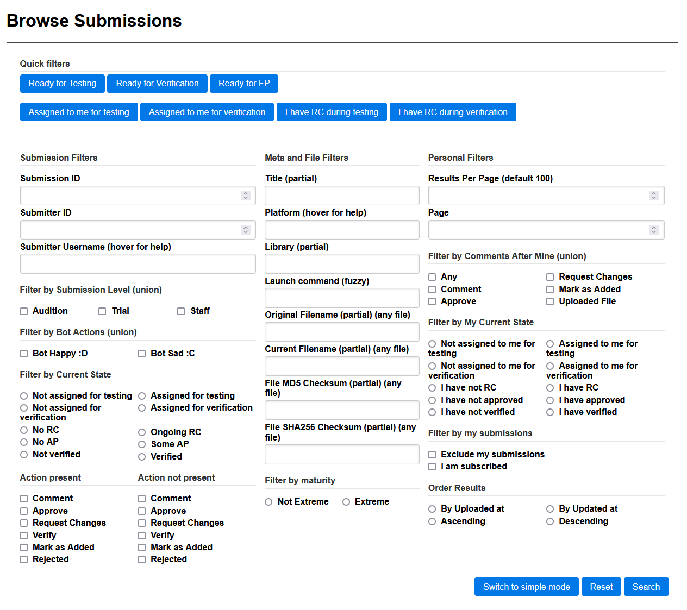

# Flashpoint's Fantastic Submission System aka FPFSS

A submission management system for [Flashpoint](https://bluemaxima.org/flashpoint/), currently running [here](https://fpfss.unstable.life/).


# Getting started

Windows is only supported through WSL2 (with Docker Desktop integration) due to missing make/sed commands to load vars for docker-compose.

Not tested on Mac, only on Linux.

## Requirements
* Git
* Go (obviously)
* GNU make
* Docker - the application needs a few microservices defined in `dc-db.yml`:
  * MySQL - db for most app data
  * PostgreSQL - db for metadata edits and updating the master list through the [launcher](https://github.com/FlashpointProject/launcher)
  * [Validator](https://github.com/FlashpointProject/Curation-Validation-Bot) - validates uploads and post about them on Discord
  
Optionally, also run the [archive indexer](https://github.com/Dri0m/recursive-archive-indexer) if you want to upload stuff to what's called Flashfreeze.

## Setting up the environment

1. Git clone this project, then fetch the submodules: `git submodule update --init --recursive`
2. Copy the `.env.template` file as `.env` and fill its details
3. Create a [Discord app](https://discord.com/developers/applications) for OAuth2 + Bot, invite the bot to your server and update `.env` with the details for both

**More detailed steps are listed below**.

## Starting the app
1. Start the necessary services with `make db` (which uses docker-compose), then run `make migrate` afterwards to update the database.
2. Start the thing with `go run ./main/*.go` or `make run`
3. Now you can visit `http://127.0.0.1:8730` (port is defined in `.env`)

Live-reloading can be optionally added by starting the application with [Gin](https://github.com/codegangsta/gin) (`go install github.com/codegangsta/gin@latest`) instead of `go run`:
```shell
GIN_PORT=8730 GIT_COMMIT=deadbeef gin --build ./main/ run ./main/main.go 
```
The command has to be run from the root directory. `GIN_PORT` is equal to the PORT defined in `.env` file. Now you can visit `http://127.0.0.1:3000`

### Database migrations
To add a new migration, add a migration for both up & down to the `migration` and `postgres_migration` directories. The filename of the migration must start with a (version) number higher than the previous migration, for example `0002_primary_platform.down.sql`.

To run a database migration, i.e if you added a new migration, run `make migrate`.

### Discord integration
This project uses __Discord for authentication and posting messages__; currently there is no mocking for those in local development. A Discord app will do these tasks, being possible to have separate bots.

You will have to find both the server and your own ID for `.env`, the easiest way being through Discord's [developer mode](https://support.discord.com/hc/en-us/articles/206346498-Where-can-I-find-my-User-Server-Message-ID-).

We need three channel IDs for bot messages (can be set up as a single channel): `bot-channel`, `curation-feed` and `notifications`. Also create at least the "The D" role for system permissions (renaming an old role will not work), and assign it to yourself. Roles are defined in `constants/roles.go`.

##### Oauth2
Create a [Discord app](https://discord.com/developers/applications) to be used with OAuth2 config; the callback for the "Redirects" field is `http://localhost:8730/auth/callback` by default. In the Authorization tab, set the scope to Bot and give it Administrator permissions (not recommended in production).

These variables are used in the .env file:
* `OAUTH_CLIENT_ID` - application ID
* `OAUTH_CLIENT_SECRET` - get it from the Discord website using the "Reset secret" button under the "OAuth" tab, do not share this
* `OAUTH_REDIRECT_URL` - needs to match the one put in Discord for OAuth2 redirect
* `FLASHPOINT_SERVER_ID` - the server ID you copied from your own private server

##### Discord bot
Create a new Discord bot (you may use the same application created for OAuth2) and click the "Reset token" button to get the private token for the bot. Do not share this token with anyone.

Open the .env file to update the following:

* `AUTH_BOT_TOKEN` - token from the previous step, if you're using a single app
* `NOTIFICATION_BOT_TOKEN` - same as the previous one
* `NOTIFICATION_CHANNEL_ID` - the ID you copied for the `notifications` channel
* `CURATION_FEED_CHANNEL_ID` - the ID you copied for the `curation-feed` channel
* `SYSTEM_UID` - your own Discord ID here

##### Inviting the bot your server
Replace "BOT_ID" in the following URL with your application's ID and open it in your browser (permission bit is 8 which makes it an administrator): `https://discord.com/oauth2/authorize?client_id=BOT_ID&permissions=8&scope=bot`

You can find the application's ID by going into the Discord developer website and clicking on "Information" in the navigation menu.

### Microservices
As mentioned before, the microservices from `make db` need to be running along with the main system. The make command runs docker-compose with the needed environment variables from `.env`.

`DB_CONTAINER_NAME` defines the name of the stack, default is `fpfssdb-local`.

##### Starting and stopping the docker-compose stack
@TODO: Implement this. Update the short steps-above as well, and any other mention of `make db`.

You can easily start and stop the stack with `make up` / `make down`.

### Launcher integration
To verify your local changes in the [launcher](https://github.com/FlashpointProject/launcher), change `baseUrl` and `fpfssBaseUrl` in its preferences.json to `http://localhost:8730`.

Mirroring Flashpoint's game data in your FPFSS requires to export a JSON from the launcher's "Export Database" option in the Developer tab, then importing it in the site's "Dev Tools" section. Memory size errors when exporting the db may require to use a dev version of the launcher.

# TODO

- Add tests, this needs some priority!
- Implement a mocking feature for authentication & permissions, so Discord is not mandatory.
- Redundant code and code weirdness is present to remind you that you shouldn't code like this
- Windows / Mac instructions you want to run this on another system

# Screenshots

it looks something like this


and this


and this


and also this


